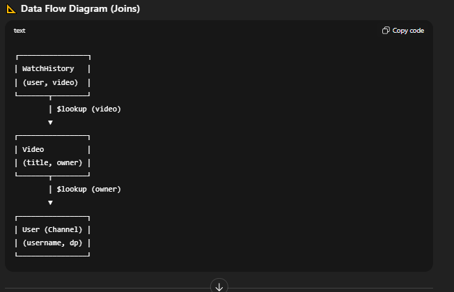
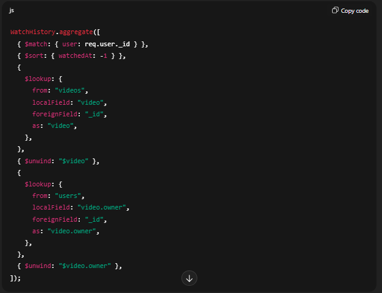
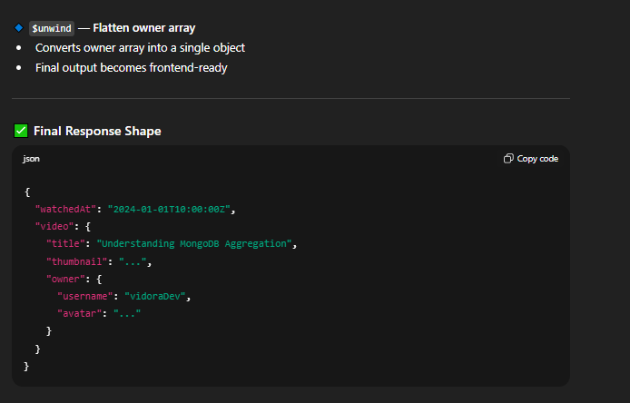
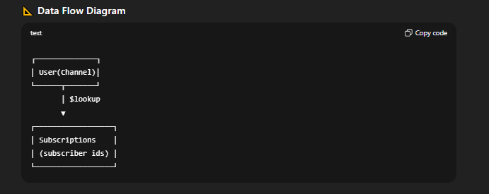
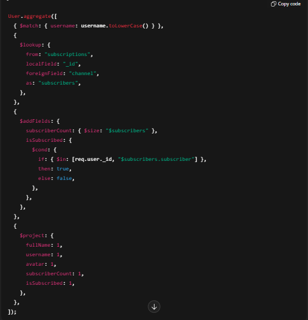

---

# 📘 Vidora -- Aggregation Pipelines Documentation

This document explains how **MongoDB aggregation pipelines** are used in the Vidora backend to efficiently fetch **watch history** and **channel profile** data using multi-collection joins.

The goals of using aggregation pipelines are:

-   Avoid multiple database queries
    
-   Prevent unbounded document growth
    
-   Return frontend-ready data
    
-   Keep the system scalable and maintainable
    

---

## 1️⃣ Watch History Aggregation Pipeline

### 🎯 Purpose

Fetch a logged-in user's watch history with:

-   Only the user's own data
    
-   Videos sorted by most recent activity
    
-   Full video metadata
    
-   Channel (video owner) information
    
-   Executed in **one database query**
    

---

### 🧩 Collections Involved

`watchhistories → videos → users`

---

### 📐 Data Flow Diagram (Joins)

  

  

  

---

### 📌 Aggregation Pipeline (Code Reference)

---

### 🔍 Stage-by-Stage Explanation

#### 🔹 `$match` --- Filter by user

`{ $match: { user: req.user._id } }`

-   Filters watch history to the currently logged-in user
    
-   Prevents data leakage
    
-   Improves performance by reducing dataset early
    

**SQL analogy**

`WHERE user = currentUserId`

---

#### 🔹 `$sort` --- Order by recent activity

`{ $sort: { watchedAt: -1 } }`

-   Orders videos by most recently watched
    
-   `-1` → descending (newest first)
    

---

#### 🔹 `$lookup` (videos) --- Join videos collection

`watchHistory.video ─────▶ videos._id`

-   Replaces `video: ObjectId` with the full video document
    
-   `$lookup` always returns an array
    

---

#### 🔹 `$unwind` --- Flatten video array

`video: [ {...} ] → video: {...}`

-   Converts array into a single object
    
-   Required for nested lookups
    

---

#### 🔹 `$lookup` (users) --- Join channel owner

`video.owner ─────▶ users._id`

-   Fetches channel (owner) profile details
    
-   Enables frontend to show username, avatar, etc.
    

---

#### 🔹 `$unwind` --- Flatten owner array

-   Converts owner array into a single object
    
-   Final output becomes frontend-ready
    

---

### ✅ Final Response Shape

---

## 2️⃣ Channel Profile Aggregation Pipeline

### 🎯 Purpose

Fetch a channel's public profile with:

-   Subscriber count
    
-   Whether the current user is subscribed
    
-   Public channel metadata
    

---

### 🧩 Collections Involved

`users ← subscriptions`

---

### 📐 Data Flow Diagram

---

### 📌 Aggregation Pipeline (Code Reference)

---

### 🔍 Stage-by-Stage Explanation

#### 🔹 `$match` --- Find channel by username

-   Matches the channel owner
    
-   Channels are accessed via username (similar to YouTube)
    

---

#### 🔹 `$lookup` --- Fetch subscribers

`subscriptions.channel ─────▶ users._id`

-   Retrieves all subscription documents for the channel
    
-   Result is an array of subscribers
    

---

#### 🔹 `$addFields` --- Compute derived data

`subscriberCount = size of subscribers array isSubscribed = current user exists in subscribers`

-   `$size` counts subscribers
    
-   `$in` checks subscription status
    
-   `$cond` converts result to boolean
    

**Key principle**

> Derived data should be computed, not stored.

---

#### 🔹 `$project` --- Shape final response

-   Selects only public fields
    
-   Prevents leaking unnecessary or sensitive data
    
-   Defines a stable API contract for frontend
    

---

### ✅ Final Response Shape

`{ "username": "vidoraCreator", "avatar": "...", "subscriberCount": 128, "isSubscribed": true }`

---

## 🧠 Core Aggregation Operators Summary

`$match → Filter documents $sort → Order results $lookup → Join collections $unwind → Flatten arrays $addFields → Add computed fields $project → Shape API response`

---

## 🔑 Design Principles Used

-   Filter early for performance
    
-   Avoid embedding unbounded arrays
    
-   Use aggregation to prevent N+1 queries
    
-   Never permanently store derived data
    
-   Return frontend-ready responses