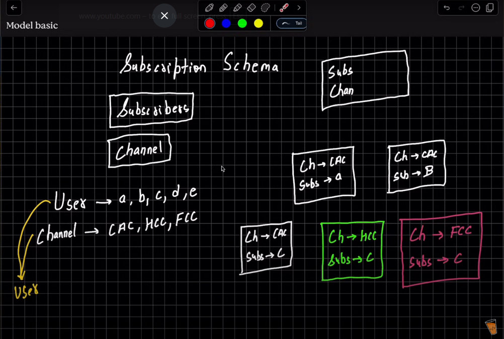

# Logic for Subscriber and Users

<!-- Commented-out image -->
<!--  -->

    

# Channel se Subscriber Milte hai, Subscriber se Channel

## About Our Subscriber Model:

1. Our Subscriber Model has two fields: **Subscriber** and **Channel**, and both of them are User.
2. What happens when a user subscribes a channel ??
3. Let's Suppose, Channels are: **GFG, CWC, FCC** and Users are: **a, b, c, d**.
4. Now, let's suppose **a** subscribes to **GFG**, then a separate document gets created:  
   - Channel: *GFG*  
   - Subscriber: *a*
5. Now, **a** can subscribe to multiple channels. Let's say it subscribes to *CWC* as well, then another document gets created:  
   - Channel: *CWC*  
   - Subscriber: *a*
6. Also, multiple users can subscribe to the same channel. Let's say **b, c** subscribe to *CWC* as well:  
   - Channel: *CWC* → Subscriber: *b*  
   - Channel: *CWC* → Subscriber: *c*
7. **Aim**: To get the Subscribers of **CWC**:  
   Count all the docs where *Channel = CWC*. *(Channel se Subscriber)*
8. **Aim**: To get how many channels **a** has subscribed:  
   Count all the docs where *Subscriber = a*, and from each doc list the Channels. *(Subscriber se Channel)*
9. In this example:  
   - **CWC** has 3 subscribers  
   - **a** subscribed to 2 channels {*CWC* and *GFG*}

## How have we implemented it here: 

   # Aggregation Piplines

   ## What are Aggregation Piplines?

   "An aggregation pipeline consists of one or more **stages** that process documents. These documents can come from a collection, a view, or a specially designed stage."

   Each stage performs an operation on the input documents.The documents that a stage outputs are then passed to the next stage in the pipeline.

   Aggregation pipelines run with the db.collection.aggregate() method.

   ## Commonly Used Aggregation Functions: 

   

